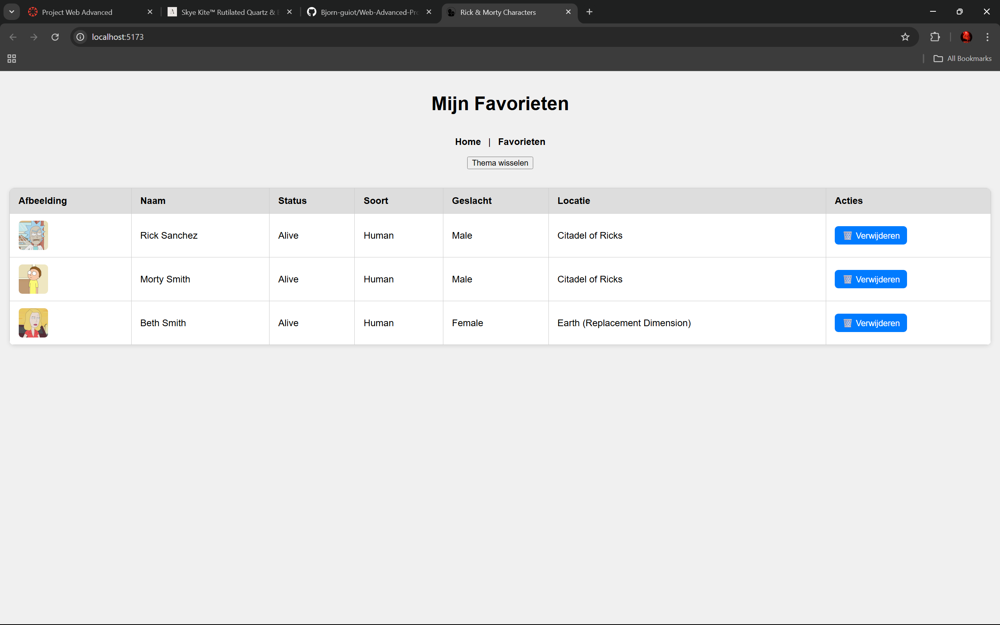

# Web Advanced Project

Een interactieve webapplicatie waarmee je karakters uit de Rick and Morty-wereld kan ontdekken, zoeken, filteren, sorteren en opslaan als favorieten.  
Gemaakt voor het vak Advanced Web.

---

## Inhoud

- [Beschrijving](#beschrijving)  
- [Features](#features)  
- [Technische vereisten en implementatie](#technische-vereisten-en-implementatie)  
- [Installatiehandleiding](#installatiehandleiding)  
- [Screenshots](#screenshots)  
- [Gebruikte API's](#gebruikte-apis)  
- [Gebruikte bronnen](#gebruikte-bronnen)  

---

## Beschrijving

Deze single-page applicatie gebruikt de Rick and Morty API om karakters op te halen.  
Gebruikers kunnen:  
- Karakters zoeken, filteren en sorteren  
- Favoriete karakters opslaan (ook na refresh bewaard!)  
- Tussen licht en donker thema wisselen  
- Favorieten apart bekijken  

---

## Features

- Dataverzameling: haalt karakters op via de Rick and Morty API  
- Zoekfunctie: zoek karakters op naam  
- Filterfunctie: filter op status (Alive, Dead, Unknown)  
- Favorieten: sla karakters lokaal op via LocalStorage  
- Observer API: animaties als kaarten in beeld komen  
- Thema wisselaar: schakel tussen licht en donker  
- Responsive Design: werkt op mobiel, tablet en desktop  

---

## Technische vereisten en implementatie

### HTML

| Technische Vereiste         | Regels                 | Toelichting                                                       |
|----------------------------|------------------------|------------------------------------------------------------------|
| **Basis HTML structuur**    | Hele bestand            | Gebruik van correcte `doctype`, `html`, `head`, en `body` tags.  |
| **Viewport meta tag**       | Regel 5                | Zorgt voor responsive design op mobiele apparaten.               |
| **Link favicon**            | Regel 4                | Toevoegen van een icoon aan de pagina.                           |
| **Script laden via module** | Regel 10               | ES module script tag: `type="module"` voor moderne JS import.    |
| **Root container**          | Regel 9                | Div met `id="app"` waar alle content dynamisch wordt ingeladen. |

### Javascript

| Technische Vereiste             | Regels (ongeveer)        | Toelichting                                                                                       |
|--------------------------------|--------------------------|--------------------------------------------------------------------------------------------------|
| **DOM manipulatie**             | 1-35, 60-115             | Elementen selecteren (`querySelector`, `getElementById`), innerHTML wijzigen, event listeners.   |
| **Constanten en variabelen**    | 1-15                     | `const` voor ongewijzigde variabelen zoals `app`, `currentPage`.                                 |
| **Template literals**           | 10-40                    | Dynamische HTML output met backticks en `${}` voor variabelen.                                   |
| **Iteratie over arrays**        | 80-100                   | `.map()` om characters in HTML om te zetten.                                                    |
| **Array methodes**              | 60-80                    | `.includes()`, `.filter()`, `.push()` gebruikt voor favorieten beheer.                           |
| **Arrow functions**             | 60-115                   | Kortere functie syntax in event handlers en callbacks.                                          |
| **Conditional (ternary) operator** | 83-90                 | Gebruikt in `renderCharacters` om knoppen te tonen afhankelijk van pagina en favorietenstatus.   |
| **Callback functions**          | 60-115                   | Event handlers toegevoegd via `.addEventListener()`.                                            |
| **Promises en Async/Await**     | 50-60, 70-95             | Asynchroon ophalen van API data met `fetch()`, `async`/`await` gebruikt bij pagina laden.        |
| **LocalStorage**                | 45-75                    | Opslaan en ophalen van favorieten en thema instellingen.                                        |
| **Thema toggling**              | 35-50                    | Klasse wisselen op `body` voor donker/licht thema met opslag in localStorage.                    |
| **Error handling**              | 55-65, 75-85             | `try/catch` blokken voor het afhandelen van fetch fouten.                                       |

### CSS

| Technische Vereiste           | Regels        | Toelichting                                                                                     |
|------------------------------|---------------|------------------------------------------------------------------------------------------------|
| **Basis CSS Styling**         | 1 - 44        | Algemene styling van `body`, `header`, `nav`, `.card`, en `img`. Gebruik van CSS variabelen (`--bg-color`, `--text-color`). |
| **Thema wisselen (licht/donker)** | 7 - 14        | Definiëren van lichte en donkere thema's via CSS variabelen en `.dark` class op `body`.           |
| **Flexbox**                  | 16 - 21       | Header als flex container, kolomrichting, ruimte tussen items (`gap`), centreren van items.      |
| **CSS Grid**                 | 26 - 30       | Grid layout voor `#character-list` met responsive kolommen via `auto-fill` en `minmax`.         |
| **Overgangen / Animaties**    | 4 - 7, 33 - 39| Transitie effecten op kleuren en op `.card` transform en opacity voor fade-in effect.            |
| **Gebruik van CSS variabelen**| 3 - 14        | Variabelen voor achtergrond- en tekstkleur, aangepast bij `.dark`.                             |
| **Gebruiksvriendelijke elementen** | 31 - 44       | Stijl voor `.card` met afgeronde hoeken, schaduw, padding en afbeelding styling voor consistentie.|

---

## Installatiehandleiding
1.	Clone deze repository:
git clone https://github.com/Bjorn-guiot/Web-Advanced-Project

2.	Installeer dependencies (met Vite):
npm install

3.	Start de Vite development server:
npm run dev

4.	Open in je browser:
http://localhost:5173/
De app is nu klaar voor gebruik!

## 📸 Screenshots

### 🌞 Light Theme

  
*De applicatie in licht thema met karakterlijst.*

---

### 🌙 Dark Theme

  
*Dezelfde weergave maar dan in donker thema.*

---

### ⭐ Favorieten Weergave

*Overzicht van je opgeslagen favoriete karakters.*

---

## 🔗 Gebruikte API's

- [Rick and Morty API](https://rickandmortyapi.com/)

---

## 📚 Gebruikte bronnen

- [Rick and Morty API documentatie](https://rickandmortyapi.com/documentation)
- [Vite officiële documentatie](https://vitejs.dev/)
- [MDN Web Docs](https://developer.mozilla.org/)
- [StackOverflow](https://stackoverflow.com/)
- [ChatGPT] (https://chatgpt.com/share/682a43bb-0638-8002-8c41-9c9eade9b560)
- [Rick and Morty SVG icons](https://mamasvg.com/product/rick-and-morty-svg-free/)